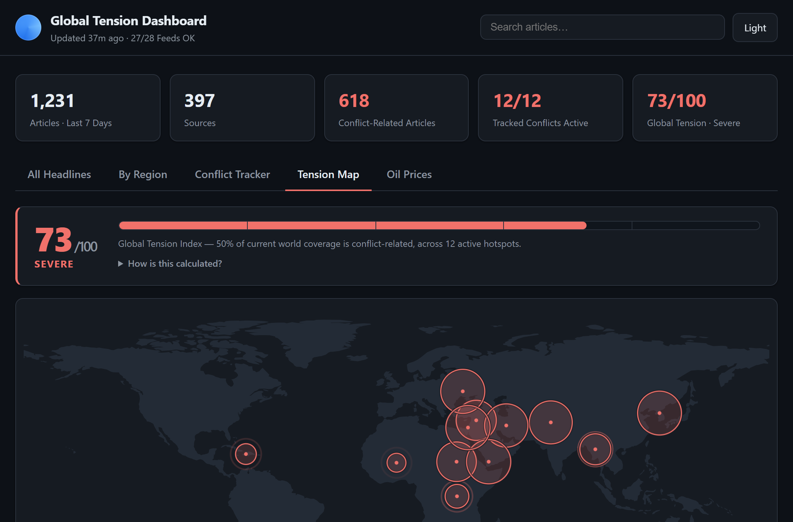
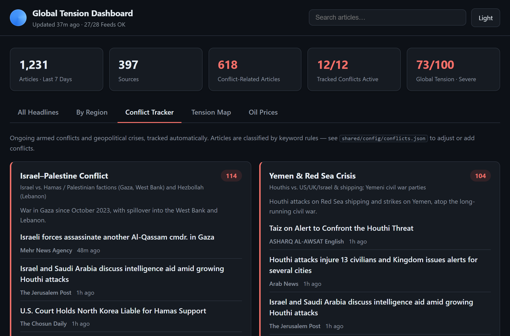
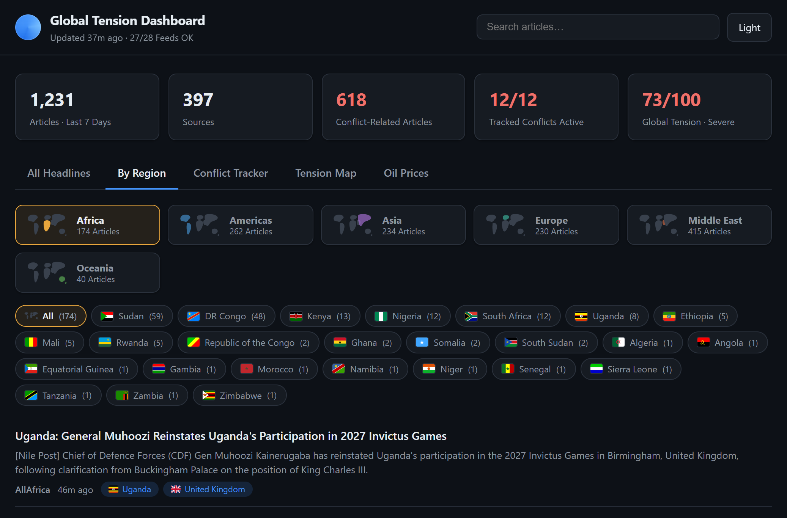
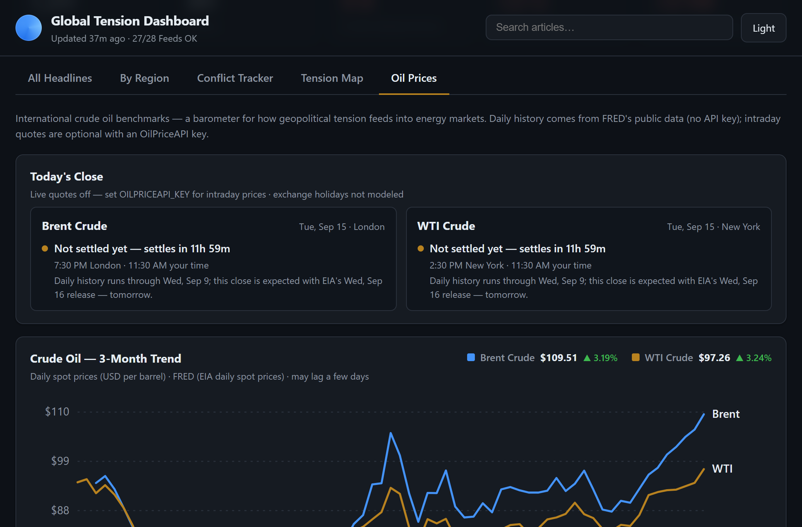
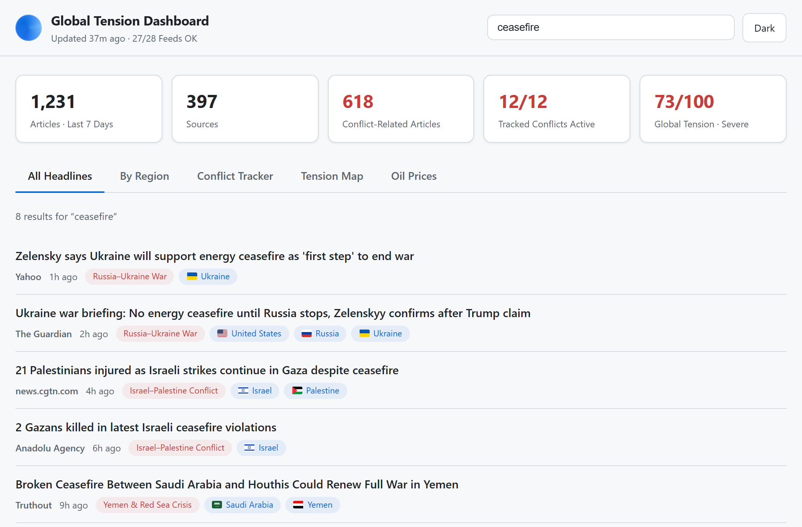

# Global Tension Dashboard

Track **world news**, **armed conflicts**, and **oil prices** with a live **Global Tension
Index** — a free, self-hosted dashboard powered entirely by public RSS feeds.
No API keys required, no accounts, no backend, no tracking.



## Features

- **Tension Map** — a world map with pulsing hotspot circles sized by each conflict's
  tension score, plus a **Global Tension Index (0–100)** computed from article volume,
  recency, and the conflict share of world coverage. Deterministic and fully explained
  in-app ("How is this calculated?").
- **Conflict Tracker** — a dedicated section for ongoing wars and geopolitical crises
  (Russia–Ukraine, Israel–Palestine, Iran tensions, Sudan, Myanmar, Sahel, DR Congo,
  Yemen/Red Sea, Syria, India–Pakistan, Korean Peninsula, Haiti). Each conflict gets its
  own card with the latest headlines and article counts.
- **Regional browsing** — filter news by continent (Africa, Americas, Asia, Europe,
  Middle East, Oceania) and drill down to individual countries.
- **Oil price tracker** — Brent & WTI crude in their own tab: 3-month daily trend with
  hover inspection, latest price, and day change. Data comes from FRED's public CSV
  endpoint (EIA daily spot prices) — like everything else, no API key.
  A **Today's Close** card counts down to each benchmark's settlement (WTI 2:30 pm
  New York, Brent 7:30 pm London), shows when EIA's next release will publish it, and —
  if you add an optional [OilPriceAPI](https://www.oilpriceapi.com) key — intraday quotes.
- **Automatic collector** — a Node script fetches ~28 public RSS feeds (BBC, Al Jazeera,
  The Guardian, DW, France 24, NPR, AllAfrica, Google News queries, and more),
  classifies every article with transparent keyword rules, dedupes across outlets, and
  stores the result as JSON.
- **Search** — instant client-side search across all collected articles.
- **Dark / light theme**, responsive layout, keyboard-accessible tabs.
- **Zero-cost deployment** — a GitHub Actions cron job collects hourly and publishes the
  static site to GitHub Pages.

| Conflict Tracker | Regional browsing (flags + continent icons) |
| --- | --- |
|  |  |

| Oil prices (Brent & WTI) | All Headlines (light theme) |
| --- | --- |
|  |  |

## Quick start

```bash
npm install
npm run collect   # fetch feeds and build public/data/news.json
npm run dev       # open http://localhost:5176
```

While `npm run dev` is running it collects on startup (when the data is over an hour
old) and hourly after that, and open tabs reload the new data automatically.

### Optional: keep data fresh without the dev server (Windows)

Nothing is scheduled unless you run this. It registers a per-user Task Scheduler task
that runs the collector with no console window; `schedule:remove` undoes it.

```bash
npm run schedule:install               # daily at 09:00, catches up if the PC was off
npm run schedule:install -- -At 06:30  # or pick a time
npm run schedule:status                # last/next run; output goes to logs/collect.log
npm run schedule:remove
```

On macOS/Linux use cron: `0 9 * * * cd /path/to/folder && npm run collect`.

### Optional: intraday oil quotes

Copy `.env.example` to `.env` and set `OILPRICEAPI_KEY`. The collector picks it up
automatically; the key stays server-side and never reaches the browser. On GitHub,
add it as a repository secret named `OILPRICEAPI_KEY` — the workflow passes it through.
Without a key, everything still works on the keyless daily history.

Other scripts:

```bash
npm test          # unit tests: classifier, store, sources, tension, markets, market clock
npm run typecheck # TypeScript check
npm run build     # production build into dist/
npm run preview   # serve the production build locally
```

## How it works

```
shared/config/feeds.json      ── which RSS feeds to pull
shared/config/conflicts.json  ── conflict definitions + keyword rules
shared/config/regions.json    ── continents, countries, aliases

collector/collect.ts  ── fetch → parse → classify → dedupe → store
public/data/news.json ── rolling 7-day window of classified articles
src/                  ── React dashboard that reads the JSON
```

1. **Collect** — every feed is fetched in parallel with a hard 30s timeout; a failing
   feed is skipped and reported, never fatal.
2. **Classify** — each article's title + summary is matched against:
   - *Conflict rules*: strong keywords ("Donbas", "Houthi", …) or pair rules that
     require both sides to appear (e.g. `russia|kremlin` **and** `ukraine|kyiv`).
   - *Country rules*: names, demonyms, capitals, and leaders for ~190 countries, with
     word-boundary matching (short codes like `US`, `UK`, `UAE` are case-sensitive) and
     special patterns so "South Sudan" never tags Sudan, "New Mexico" never tags Mexico,
     "Papua New Guinea" never tags Guinea, and so on.
3. **Store** — articles merge into a rolling 7-day window (capped at 3,000), deduped by
   link *and* by normalized title so the same story from two outlets appears once.
   Stored articles are re-classified on every run, so rule improvements apply
   retroactively.
4. **Score** — `shared/tension.ts` turns the classified data into tension scores:
   - *Per conflict (0–100)*: article volume weighted by recency (48-hour half-life),
     mapped through a saturating curve — `100 * (1 - e^(-W/25))`.
   - *Global Tension Index (0–100)*: 50% the mean of the five hottest conflicts +
     50% the share of all collected articles that are conflict-tagged.
   The map view places each conflict at its configured epicenter (`lat`/`lon` in
   `conflicts.json`) on a world silhouette pre-generated from Natural Earth data
   (`scripts/generate-map.mjs` — no map libraries shipped to the browser).
5. **Markets** — the same collector run pulls Brent and WTI daily spot prices from
   FRED's public CSV endpoint, EIA's release schedule from its spot price page, and
   (with a key) intraday quotes into `public/data/markets.json`. Every part is
   best-effort: a failure keeps the previous value and never breaks the news run.
   Settlement countdowns come from `shared/marketClock.ts` (time-zone aware; exchange
   holidays are not modeled).

Everything is deterministic and inspectable — no AI, no black boxes.

## Customizing

- **Add a feed**: append `{ "id": "...", "name": "...", "url": "..." }` to
  `shared/config/feeds.json`. Optional `regionHint` assigns a region when no country is
  detected in the text.
- **Track a new conflict**: add an entry to `shared/config/conflicts.json` with `any`
  (single strong keywords) and/or `pairs` (both groups must match) rules, plus an
  `epicenter` (`lat`/`lon`) for the tension map. Optionally add a Google News query
  feed for better recall.
- **Tune countries**: edit aliases in `shared/config/regions.json`; the optional
  `pattern` field takes a full regex for tricky names.

The dashboard picks up config changes automatically — conflict cards, region tabs, and
country chips are all generated from these files.

## Deploying to GitHub Pages

1. Push this repository to GitHub.
2. In the repo settings, set **Pages → Source** to **GitHub Actions**.
3. The included workflow (`.github/workflows/collect-and-deploy.yml`) runs hourly:
   it collects fresh news, commits the updated data, and deploys the site.

Adjust the cron expression in the workflow to change the update frequency.

## Notes & disclaimer

- Headlines and summaries link to and belong to their original publishers. This project
  only aggregates publicly provided RSS metadata, stores nothing else, and shows no ads.
- Oil prices are EIA daily spot prices via FRED, published weekly with a few days' lag;
  intraday quotes are only as fresh as the last collector run. Informational only,
  not trading data.
- Conflict classification is keyword-based and intentionally recall-oriented; expect the
  occasional mistagged article. Rules live in plain JSON — improvements welcome.

## License

[MIT](LICENSE)
